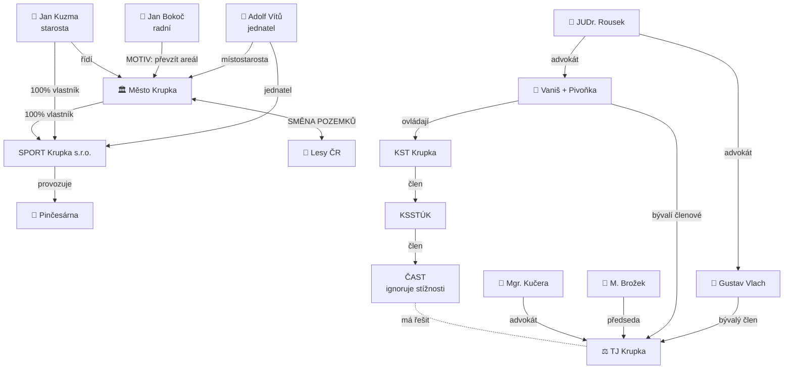

> [!NOTE] 🏠 TOTO JE HLAVNÍ VSTUPNÍ STRANA VAULTU. Pro systémovou dokumentaci viz [[START_HERE]].

 

# 🏠 KAUZA TJ KRUPKA

#### ⚖️ Analytický znalostní systém | [tjk.manus.space](https://tjk.manus.space)

**Víceletý strukturovaný přehled sporu o TJ Krupka — od převzetí spolku přes systematickou obstrukci až po soudní řízení a trestní oznámení.**

---

## ⚡ AKTUÁLNÍ STAV

> [!tip] ✅ Soudy — 2 vyhrané
> KS Ústí 2× rozhodl ve prospěch TJ Krupka. Náklady řízení přiznány.

> [!warning] ⚠️ Trestní řízení
> Odloženo. Schůzka se SZ Teplice neproběhla. ZN 69/2024-8.

> [!danger] 🔴 Město Krupka
> UR-314–316 schváleny na ZM. Pinčesárna i celý areál ohroženy.

> [!warning] ⚠️ Lesy ČR
> Varování odesláno 1.7.2026. Pohledávka ~500 000 Kč na nájemném.

> [!danger] 🔴 ČAST
> Stížnosti ignorovány. Systematické porušování stanov přehlíženo.

> [!warning] ⚠️ Žaloba — 1 810 176 Kč
> Stav neznámý. Čeká se na vyjádření soudu.

---

## 🧭 ROZCESTNÍK — HLAVNÍ SEKCE

> [!tip] 📋 PŘEHLED KAUZY
> Kompletní vstupní přehled celé kauzy pro nové čtenáře a web.
>
> **Rychlé odkazy:** [[VYS-2026-001_Prehled_kauzy_pro_web]], [[ZIVE_SHRNUTI_KAUZY]], [[START_HERE]]
>
> 📁 [[09_Vystupy/|Výstupy →]]

> [!tip] 👥 AKTÉŘI A VAZBY
> Infografika klíčových osob, organizací a jejich vztahů.
>
> **Rychlé odkazy:** [[VYS-2026-002_Infografika_vazeb]], [[OSO-2026-001_Miroslav_Brozek|M. Brožek]], [[OSO-2026-018_Jan_Kuzma_starosta|J. Kuzma]]
>
> 📁 [[01_Osoby/|Osoby →]] · [[02_Organizace/|Organizace →]]

> [!tip] 📅 ČASOVÁ OSA
> Chronologický přehled 2021–2026 — 44+ událostí s daty a vazbami.
>
> **Rychlé odkazy:** [[06_Casova_Osa/CAS-2026-001_Casova_Osa_TJK_2021_2026]], [[JEDNOSTRÁNKOVÁ ČASOVÁ OSA]]
>
> 📁 [[06_Casova_Osa/|Časová osa →]]

> [!warning] 🔑 KLÍČOVÉ UDÁLOSTI
> 6 definovaných klíčových událostí — od ignorace ČAST po znemožnění přístupu.
>
> **Rychlé odkazy:** [[11_Klicove_Udalosti/INDEX_Klicove_Udalosti]], [[KUDA-2026-003_Trestni_oznameni_a_policni_rizeni]], [[KUDA-2026-005_Znemožnění_přístupu_do_pinčesárny]]
>
> 📁 [[11_Klicove_Udalosti/|Klíčové události →]]

> [!warning] 🗳️ SHROMÁŽDĚNÍ DELEGÁTŮ
> 10+ shromáždění — od zvolení Brožka až po Vanišovo nelegální shromáždění.
>
> **Rychlé odkazy:** [[17_Schromazdeni_Delegatu/INDEX_Schromazdeni_Delegatu]], [[UDA-2026-041_Mimořádné_SD_TJK_29-6-2025|SD 29.6.2025]], [[UDA-2026-010_Nelegalni_shromazdeni_Vanis_19-10-2023|Nelegální SD]]
>
> 📁 [[17_Schromazdeni_Delegatu/|Shromáždění delegátů →]]

> [!danger] ⚔️ SOUDNÍ ŘÍZENÍ
> 8 aktivních/ukončených soudních řízení. Aktuální stav, lhůty, pohledávky.
>
> **Rychlé odkazy:** [[14_Dashboard/UKOLY_A_STAV]], [[10_Pravni_Podklady/PRP-2026-001_Shrnuti_pro_statni_zastupkyni]]
>
> 📁 [[10_Pravni_Podklady/|Právní podklady →]] · [[14_Dashboard/|Dashboard →]]

> [!example] 🔍 DŮKAZY
> 103+ důkazů včetně webových DUK-2026-020–025. Kompletní důkazní matice.
>
> **Rychlé odkazy:** [[DUK-2026-020_Volebni_program_Bokoce]], [[DUK-2026-021_Vanisuv_prevod_majetku]], [[DUK-2026-022_Podvodne_shromazdeni_Vanis]]
>
> 📁 [[04_Dukazy/|Důkazy →]] · [[14_Dashboard/Dukazy_Prehled|Přehled důkazů →]]

> [!example] 📊 ANALÝZY
> Hloubkové analýzy Lesů ČR, Města Krupka a bývalých členů včetně ČAST.
>
> **Rychlé odkazy:** [[ANL-2026-004_Prehled_jednani_Lesy_CR]], [[ANL-2026-005_Prehled_jednani_Mesto_Krupka]], [[ANL-2026-006_Prehled_byvali_clenove]]
>
> 📁 [[08_Analyzy/|Analýzy →]]

> [!example] ⚖️ PRÁVNÍ RÁMEC
> Shrnutí pro SZ, paragrafy 10 zákonů a právní argumentace.
>
> **Rychlé odkazy:** [[PRP-2026-001_Shrnuti_pro_statni_zastupkyni]], §209 TZ, §220 TZ, §254 TZ
>
> 📁 [[10_Pravni_Podklady/|Právní podklady →]] · [[16_Zakony/|Zákony →]]

> [!info] 🏛️ MĚSTO KRUPKA
> UR-899, UR-314–316, smyčky absurdity, SMĚNA POZEMKŮ, 2 000 000 Kč úvěr.
>
> **Rychlé odkazy:** [[ANL-2026-005_Prehled_jednani_Mesto_Krupka]], [[❌ 90_shrnující_upřesňující_dokumenty_k_klíčovým_událostem/Smyčka Absurdity]]
>
> 📁 [[ORG-2026-002_Mesto_Krupka|Organizace →]] · [[OSO-2026-018_Jan_Kuzma_starosta|J. Kuzma →]]

> [!info] 🌲 LESY ČR
> Dojednané nájemné, neuhrazená pohledávka 500 tis., advokátní obstrukce.
>
> **Rychlé odkazy:** [[ANL-2026-004_Prehled_jednani_Lesy_CR]], [[LESY - POHLEDÁVKA]], [[LESY ČR]]
>
> 📁 [[ORG-2026-008_Lesy_CR|Organizace →]]

> [!info] 👤 BÝVALÍ ČLENOVÉ
> Vaniš, Pivoňka, Vlach — převod majetku, nezákonné vyloučení, pokladna 26 674 Kč.
>
> **Rychlé odkazy:** [[ANL-2026-006_Prehled_byvali_clenove]], [[OSO-2026-002_Marek_Vanis|Vaniš]], [[OSO-2026-003_Jaromir_Pivonka|Pivoňka]], [[OSO-2026-004_Gustav_Vlach|Vlach]]
>
> 📁 [[OSO-2026-010_JUDr_Rousek|JUDr. Rousek →]] · [[OSO-2026-015_Mgr_Kucera|Mgr. Kučera →]]

---

## 📌 RYCHLÉ ODKAZY — NEJŽÁDANĚJŠÍ

| Odkaz | Cíl |
|-------|-----|
| ⚠️ Ke schválení | [[SPORNE_POLOZKY_KE_SCHVALENI]] |
| 📝 Živé shrnutí | [[ZIVE_SHRNUTI_KAUZY]] |
| 🌐 Web kauzy | [tjk.manus.space](https://tjk.manus.space) |
| 📄 Smyčka absurdity | [[❌ 90_shrnující_upřesňující_dokumenty_k_klíčovým_událostem/Smyčka Absurdity]] |
| 📐 Jednostránková osa | [[JEDNOSTRÁNKOVÁ ČASOVÁ OSA]] |
| 🏗️ Úkoly a stav | [[14_Dashboard/UKOLY_A_STAV]] |
| 📋 Dashboard | [[14_Dashboard/Hlavni_Dashboard]] |
| 📖 START HERE | [[START_HERE]] |

---

## 🕸️ MAPA VAZEB

---

## 🔴 KALENDÁŘ — NADCHÁZEJÍCÍ DEADLINY

| Deadline | Co | Priorita |
|----------|-----|:--------:|
| ~3.8.2026 | Lhůta pro napadení 2. vyloučení V+P | 🔴 |
| Neurčeno | VS Praha — 2 Cmo 11/2026 (Vlach) | 🔴 |
| Neurčeno | Schůzka SZ Teplice (ZN 69/2024-8) | 🟡 |

---

## 📊 STATISTIKA VAULTU

📁 **24** osob · 🏢 **9** organizací · 📅 **44** událostí · 🔍 **103+** důkazů · ⚖️ **8** soudních řízení

---

## 🔧 SYSTÉM

| Nástroj | Odkaz |
|---------|-------|
| 🤖 AI Review Prompt | [[15_System/AI_Review_Prompt]] |
| 📋 AI Prompty | [[15_System/AI_Prompty]] |
| 🏷️ Identifikátory | [[15_System/Identifikatory]] |
| 📥 Import Workflow | [[15_System/Import_Workflow]] |
| ⚙️ Konfigurace | [[15_System/Konfigurace]] |

---

*Systém vytvořen: 2026-06-18 · Naposledy aktualizován: 2026-07-06*
*AI Review: spustit přes [[15_System/AI_Review_Prompt]]*
